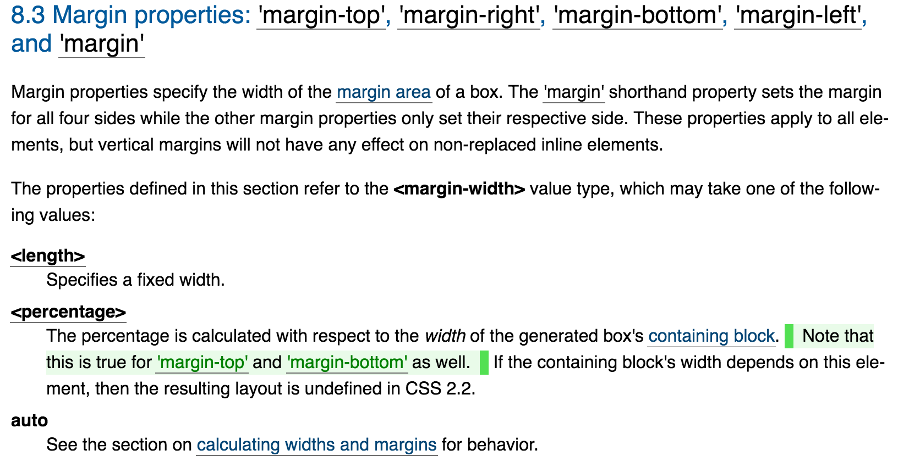
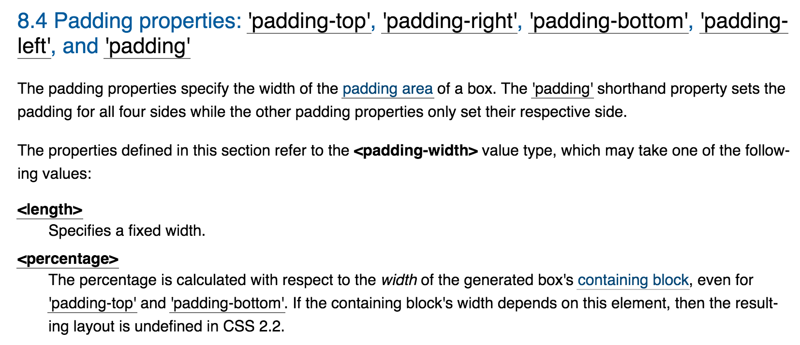

### margin和padding值为百分比时，都是根据父元素容器宽度计算的

#### 规范：





#### 应用：

##### 高度自适应占位

###### 方案一：利用padding-top撑高容器

因为padding为百分比时，是根据父元素宽来计算的，所以可以利用这一特性实现高度自适应占位，将padding-top/bottom设置与width一致的值

实现代码：

**HTML**

```
<div class="p"></div>
```

**CSS**

```
div {
    width: 50%;
    background: yellow;
}
.p {
    padding-top: 50%;
}
```

[DEMO](http://jsbin.sankuai.com/sik/edit?html,css,output)

**局限**

无法给容器设置`min-height`，因为max-height只能限制内容高度，而不能限制padding，即使设置`box-sizing: border-box;`依旧无效

###### 利用子元素/伪元素设置margin/padding撑高容器

做法：设置子元素/伪元素的margin/padding-top/bottom为100%，使得容器实际高度等于容器的宽度，建议使用伪元素。这样容器本身就是有高度了，可以设置`max-height`有效

实现代码：

**HTML**

```
<div class="p"></div>
```

**CSS**

```
div {
    width: 50%;
    background: yellow;
}
.p:after {
    content: '';
    display: block;
    padding-top: 100%;
}
```

[DEMO](http://jsbin.sankuai.com/kux/edit?html,css,output)

**注意**

设置伪元素的margin-top/bottom，会出现margin collapse，可以通过设置`overflow: hidden;` 新建一个BFC，来消除margin折叠。当然使用padding-top/bottom就不存在这个问题了

###### 方案三：CSS3新单位vw

CSS3新增一组相对于可视区域百分比的长度单位：

* `vw` 相对于可视区域宽度百分比的单位，`1vw = 1% viewport width`
* `vh` 相对于可视区域高度百分比的单位，`1vh = 1% viewport height`
* `vmin` 相对于可视区域 **宽高** 中 **较小** 的一个的百分比单位，`1vmin = 1% min(viewport w, viewport h)`
* `vmax` 相对于可视区域 **宽高** 中 **较大** 的一个百分比单位，`1vmax = 1% max(viewport w, viewport h)`

[浏览器兼容性](http://caniuse.com/#feat=viewport-units)

实现代码：

**HTML**

```
<div class="p"></div>
```

**CSS**

```
width: 50%;
    background: yellow;
}
.p {
    height: 50vw;
}
```

[DEMO](http://jsbin.sankuai.com/quc/edit?html,css,output)
